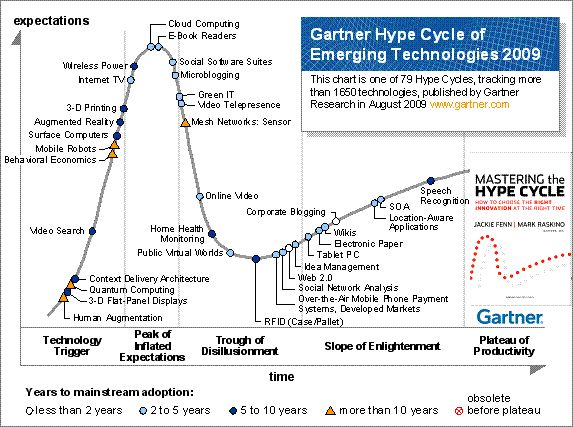
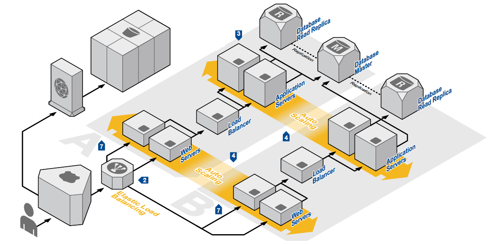
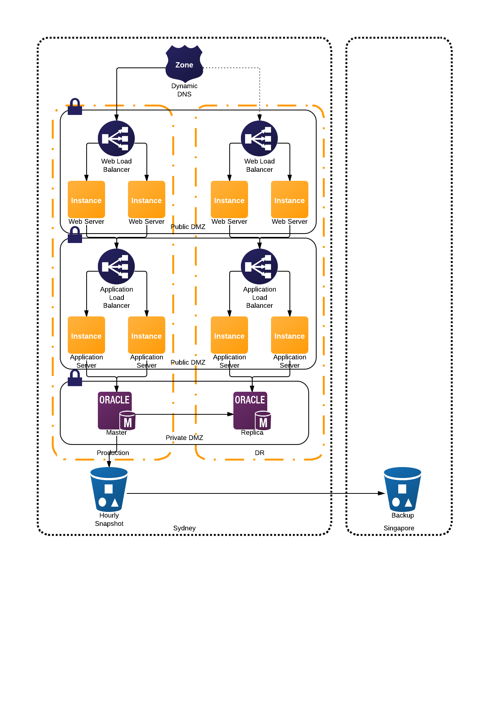

# aws-presentation

!SLIDE

# Introduction to the "C" word

## quintona@izazi.com

!SLIDE left

# Um, what?

* The C Word = "Cloud" Hype
* Does Cloud == Cloud?
* What is Cloud?
* AWS Services
* Cost Model Implications
* IT Operational Maturity

!SLIDE left

# The C Word = "Cloud" Hype



* Due for some downhill, or are we?
* Depends on what cloud means to you...

!SLIDE

# Does Cloud == Cloud?

}}} images/cloudBackground.jpg


!SLIDE left

# Does Cloud == Cloud?

* CEO/CFO: "Silver Bullet to make my IT cheaper and faster"
* Security Officer: "Hosting our systems somewhere else, crazy, risky"
* CIO: "Reduced Infrastructure Cost, Makes DR Easier"
* Enterprise Architect: "Now I have design all my systems to be massively parallel"
* IT Operations Manager: "I used to manage 10 servers, now I managed hundreds, I think"
* DevOps Team Member: "We are battling to get the developers and infrastructure to work together"
* COTS Provider: "Of course we are cloud enabled, whatever that means"

!SLIDE left

# Removing the Noise - What is a Cloud?

* Type 1 Hypervisor
* Some management systems
* A different commercial model 
	* Aggregate Capacity
	* Billing - pay as you use

!SLIDE left

# But what about?

* Software As A Service?
* Platform As A Service?
* Infrastructure As A Service?

!SLIDE left

# Enterprise Architecture



!SLIDE left

# Enterprise Architecture

* High Availability
* Disaster Recovery
* DMZ and Network Considerations
* Non Production Environments
* ...

!SLIDE left

# AWS Services

* Computing and Networking
	* EC2 - Immutable Compute Nodes
	* EBS - Elastic Block Storage
	* Elastic MapReduce
	* Route 53 - Scalable DNS
	* VPC - Virtual Private Cloud
!SLIDE left

# AWS Services

* Storage and Related
	* S3 - Simple Storage Service
	* Cloud Front

!SLIDE left

# AWS Services

* Database
	* Dynamo DB - NoSQL as a Service
	* ElastiCache - Memcache as a service
	* RDS - Relational DB as a service
!SLIDE left

# AWS Services

* Management
	* Cloud Formation
	* Cloud Watch
	* IAM
	
!SLIDE left

# AWS Services

* App Services
	* Cloud Search
	* Simple Queue Service
	* ...
	
!SLIDE left

# What is the service part?

* All these services as exposed as SOA services
* Leads to infrastructure as a service
* EC2:

``` java
AmazonEC2 ec2 = new  AmazonEC2(myCredentials);
ec2.setEndpoint("https://eu-west-1.ec2.amazonaws.com");
```

* S3:

``` java
Statement allowPublicReadStatement = new Statement(Effect.Allow)
         .withPrincipals(Principal.AllUsers)
         .withActions(S3Actions.GetObject)
         .withResources(new S3ObjectResource(myBucketName, "*"));
Statement allowRestrictedWriteStatement = new Statement(Effect.Allow)
         .withPrincipals(new Principal("123456789"), new Principal("876543210"))
         .withActions(S3Actions.PutObject)
         .withResources(new S3ObjectResource(myBucketName, "*"));

Policy policy = new Policy()
         .withStatements(allowPublicReadStatement, allowRestrictedWriteStatement);

AmazonS3 s3 = new AmazonS3Client(myAwsCredentials);
s3.setBucketPolicy(myBucketName, policy.toJson());
```

!SLIDE left

# Example Architecture



!SLIDE left

# Cost Model Implications

* Only pay for what you use - Don't "pay" for unused capacity
* Agility
* Capex Vs Opex
* Non Production environments are a huge win!

!SLIDE left

# IT Operational Maturity

* Largest cause of IT operational issues?  
* Removed Risks! By making their impact Zero.
	* Continuous Delivery
	* Automated Testing
	* Infrastructure as code
	* Know the state of your systems
	* Version Control
	
* Automate Everything!